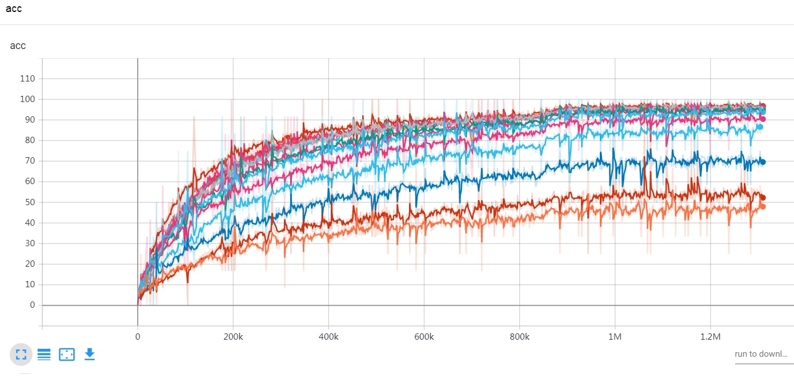
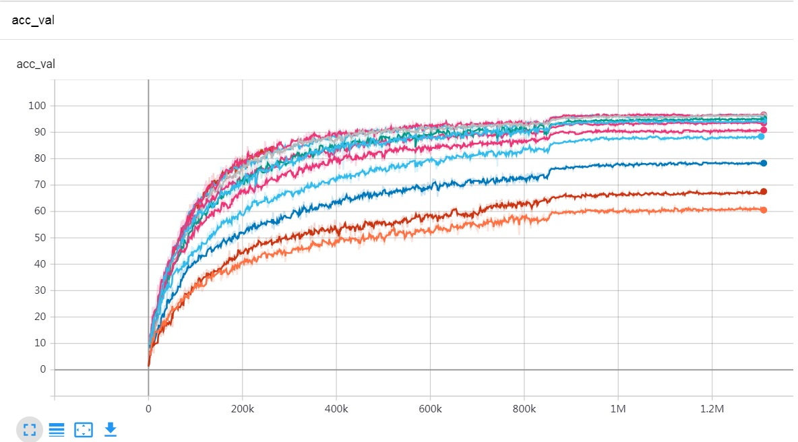

# pytorch-cnn-learning VGG GoogleNet ResNet BottleNeck
Pytorch CNN 入门教程，包含了CNN网络从最简单的网络结构逐渐增加网络复杂度，增加BN层、增加初始化参数、增加VGG、GoogleNet、ResNet、BottleNeck等等；
训练数据使用tensorboardX生成图表，可以直观的看到这些网络在训练集和测试集的训练曲线，比较测试效果；

QQ：21109410 欢迎交流！
